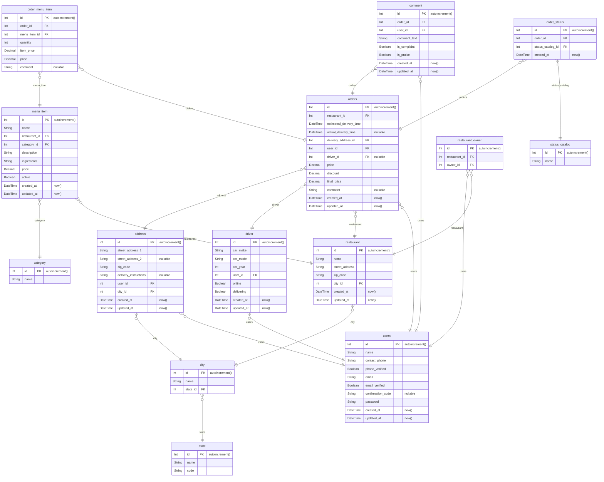

# Byte Dash

A restaurant food delivery service database implemented with [drizzle](https://orm.drizzle.team/).

View the dbdocs diagram [here](https://dbdocs.io/w3cj/bytedash?schema=public&view=relationships).



# Getting Started

## Create .env file

Copy the `.env.sample` file and update the values accordingly. If you are using `docker compose` you can leave the values as is.

```sh
cp .env.sample .env
```

## Start A PostgreSQL Database with Docker Compose

```sh
docker compose up
```

## Migrate the DB

```sh
npm run db:migrate
```

## Seed the DB

```sh
npm run db:seed
```

## Start the Example API

```sh
npm run dev:api
```

## Run the API Client

```sh
npm run dev:client
```